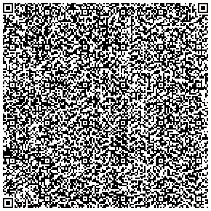

# QR Teleport

[](./LICENSE)

- Encodes files to QR codes
  - A directory will be first tarballed and encoded to base64

## Quick Start

### Ubuntu/KylinOS

```bash
git clone https://github.com/Welkin-Y/qr-teleport.git --depth 1
cd qr-teleport
chmod +x qrteleport.sh
```

### MacOS

```bash
brew install qrencode
git clone https://github.com/Welkin-Y/qr-teleport.git --depth 1
cd qr-teleport
chmod +x qrteleport.sh
```

## Usage

```bash
./qrteleport.sh [-v] [-t] <filepath> [outdir] [chunksdir]

-v: use verbose output
-t: use text output instead of PNG
<filepath>: path to the file or directory to encode
[outdir]: output directory for the QR codes (default: ./codes/)
[chunksdir]: temporary directory for file chunks (default: ./_tmp_chunks/)
```

## Example



[Example ASCII](./docs/qrteleport.sh-0000.txt)
